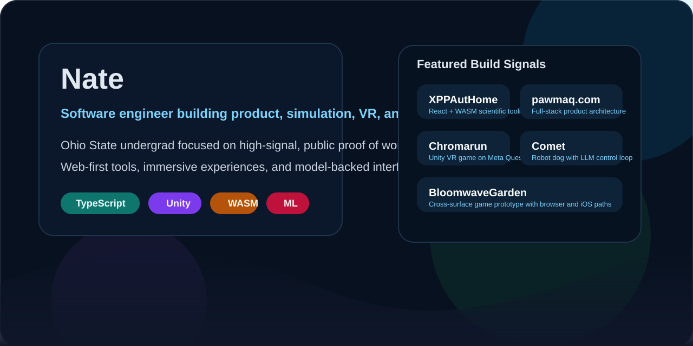

# Nate

<p align="center">
  
</p>

<p align="center">
  Undergraduate engineer at The Ohio State University building product-focused web, mobile, VR, and AI-driven systems.
</p>

<p align="center">
  <a href="https://github.com/Nate27624?tab=repositories"></a>
  
  
  
</p>

## What I Build

- Full-stack product work with React, TypeScript, backend APIs, and systems thinking
- Interactive experiences across mobile, VR, and browser-based runtimes
- Applied AI/ML projects that connect models to real interfaces and workflows

## Featured Projects

<table>
  <tr>
    <td width="50%" valign="top">
      <h3><a href="https://github.com/Nate27624/XPPAutHome">XPPAutHome</a></h3>
      <p>Web-first XPPAUT port for neuroscience workflows with model upload, simulation, phase-plane analysis, bifurcation views, and export tooling.</p>
      <p><strong>Stack:</strong> TypeScript, React, Vite, C, WASM</p>
      <p><strong>Signal:</strong> Bridges scientific computing into a browser runtime with a WASM-first execution path and typed worker APIs.</p>
      <p><a href="https://github.com/Nate27624/XPPAutHome">Repo</a> · <a href="https://nate27624.github.io/XPPAutHome/">Live demo</a></p>
    </td>
    <td width="50%" valign="top">
      <h3><a href="https://github.com/Nate27624/pawmaq.com">pawmaq.com</a></h3>
      <p>Open-source social platform workspace exploring moderation-first architecture, passkey-based auth, media posting, and feed design.</p>
      <p><strong>Stack:</strong> TypeScript, React, Node, WebAuthn</p>
      <p><strong>Signal:</strong> Product-minded system design across auth, moderation, content flows, and frontend UX.</p>
      <p><a href="https://github.com/Nate27624/pawmaq.com">Repo</a></p>
    </td>
  </tr>
  <tr>
    <td width="50%" valign="top">
      <h3><a href="https://github.com/Nate27624/BloomwaveGarden">BloomwaveGarden</a></h3>
      <p>Interactive bloom-burst garden game prototype built for both browser play and native iOS iteration.</p>
      <p><strong>Stack:</strong> JavaScript, Swift, CSS, HTML</p>
      <p><strong>Signal:</strong> Gameplay loop design, HUD systems, audio handling, and cross-surface prototyping.</p>
      <p><a href="https://github.com/Nate27624/BloomwaveGarden">Repo</a></p>
    </td>
    <td width="50%" valign="top">
      <h3><a href="https://github.com/Nate27624/Chromarun">Chromarun</a></h3>
      <p>VR game project shipped to the Meta Quest ecosystem, backed by a public codebase and store presence.</p>
      <p><strong>Stack:</strong> C#, Unity, Meta Quest</p>
      <p><strong>Signal:</strong> Real interactive product work in VR with public proof beyond source code alone.</p>
      <p><a href="https://github.com/Nate27624/Chromarun">Repo</a> · <a href="https://www.meta.com/experiences/chromarun/4405707952806774/">Meta listing</a></p>
    </td>
  </tr>
  <tr>
    <td width="50%" valign="top">
      <h3><a href="https://github.com/Nate27624/robot-dog">Comet</a></h3>
      <p>LLM-driven robot dog project built around a Unitree Go2 with Android, controller, and server components.</p>
      <p><strong>Stack:</strong> Python, Jupyter, Unity, C#, Gemini, Wit.AI</p>
      <p><strong>Signal:</strong> Multi-component robotics integration spanning speech input, control flow, and model-backed behavior.</p>
      <p><a href="https://github.com/Nate27624/robot-dog">Repo</a></p>
    </td>
    <td width="50%" valign="top">
      <h3>Selected Exploration</h3>
      <p><a href="https://github.com/Nate27624/ProgrammingChallenge">ProgrammingChallenge</a> explores speech emotion recognition in PyTorch and complements the product-heavy projects above with applied ML work.</p>
      <p><a href="https://github.com/Nate27624/ARChatDBs">ARChatDBs</a> and <a href="https://github.com/Nate27624/HACKI-O2025">HACKI-O2025</a> round out the public account with AR/data and hackathon experimentation.</p>
    </td>
  </tr>
</table>

## Technical Focus

```text
TypeScript / React / Vite
Scientific tooling and browser runtimes
Unity / VR / interactive systems
Mobile prototyping
Applied AI and ML workflows
```

## Contact

- GitHub: [@Nate27624](https://github.com/Nate27624)
- Demo: [XPPAutHome live build](https://nate27624.github.io/XPPAutHome/)
- Product listing: [Chromarun on Meta Quest](https://www.meta.com/experiences/chromarun/4405707952806774/)
