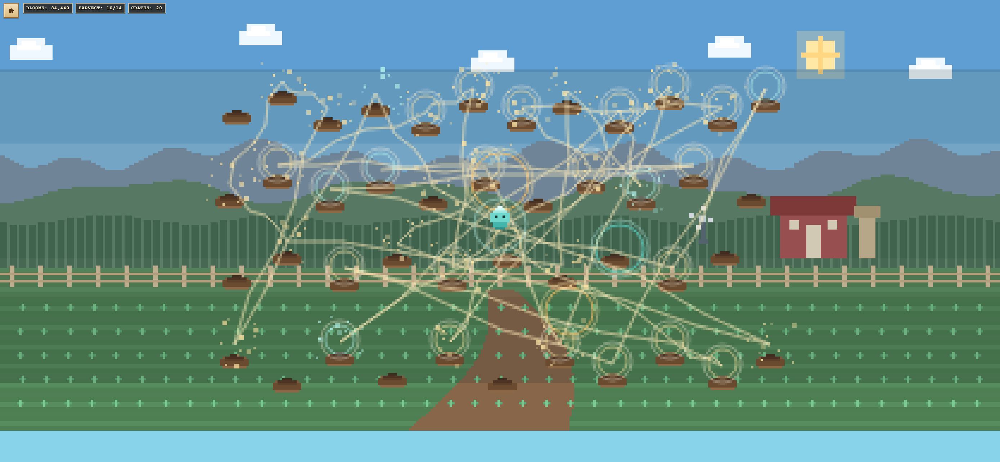
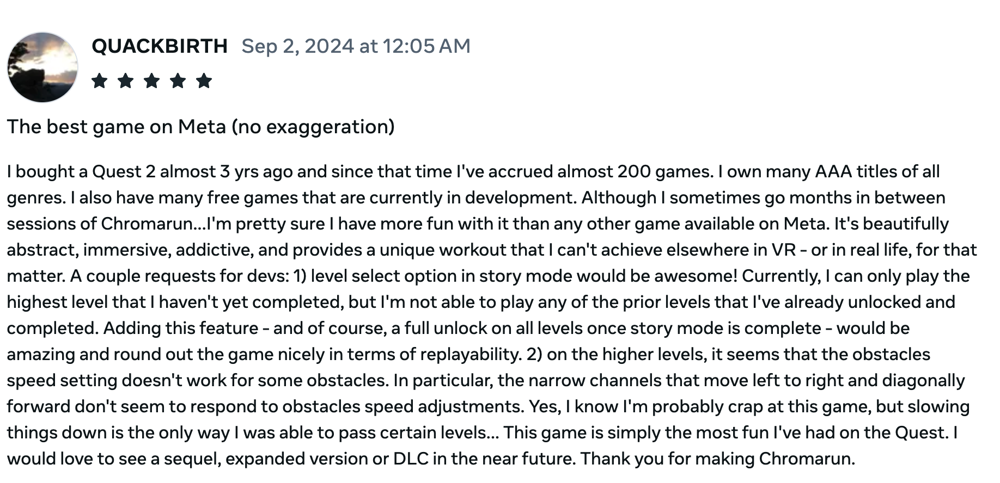

# Nate Arens

Software engineer at Ohio State, graduating May 2027.

The work here centers on shipped XR software, real-time interactive systems, browser-based technical tools, and AI-backed prototypes that connect models to actual interfaces.

  <a href="https://github.com/Nate27624/Chromarun">Chromarun</a> /
  <a href="https://github.com/Nate27624/XPPAutHome">XPPAutHome</a> /
  <a href="https://github.com/Nate27624/robot-dog">Comet</a> /
  <a href="https://github.com/Nate27624/ARChat-showcase">ARChat</a> /
  <a href="https://github.com/Nate27624/BloomwaveGarden">BloomwaveGarden</a>

<table>
  <tr>
    <td><strong>Shipped XR product</strong></td>
    <td>Chromarun reached 1,150+ installs and 575+ lifetime active users on Meta Quest.</td>
  </tr>
  <tr>
    <td><strong>Scientific web tooling</strong></td>
    <td>XPPAutHome ports XPPAUT workflows to the browser with a WASM-first runtime.</td>
  </tr>
  <tr>
    <td><strong>Robotics + AI</strong></td>
    <td>Comet maps natural-language input into a defined robot command set for a Unitree Go2.</td>
  </tr>
  <tr>
    <td><strong>XR + data</strong></td>
    <td>ARChat links QR-loaded context, natural-language questions, and AR overlays on Quest 3.</td>
  </tr>
</table>

## Open Something

<table>
  <tr>
    <td width="50%" align="center" valign="top">
      
       
      <strong>Chromarun trailer</strong>
       
      <a href="https://www.meta.com/experiences/chromarun/4405707952806774/">Meta listing</a> · <a href="https://www.youtube.com/watch?v=3sIsHlFQGgE">Trailer</a>
       
      <a href="https://www.youtube.com/watch?v=RLCw0jw2iWA&list=PLzLJrZy1zzpC5rQm2ozT7f3oe-LIgFPBc"><strong>Watch the full level playlist</strong></a>
    </td>
    <td width="50%" align="center" valign="top">
      
       
      <strong>Bloomwave Garden web build</strong>
       
      <a href="https://nate27624.github.io/BloomwaveGarden/">Play in browser</a> · <a href="https://github.com/Nate27624/BloomwaveGarden">Repo</a>
    </td>
  </tr>
</table>

## Selected Work

<table>
  <tr>
    <td width="50%" valign="top">
      <h3><a href="https://github.com/Nate27624/Chromarun">Chromarun</a></h3>
      
Founded <strong>Targy LLC</strong> and built the shipped Meta Quest VR game myself.

      
Key systems include 40 handcrafted levels, hand tracking, saves, leaderboards, custom levels, and a raycast-driven procedural mode for an effectively unlimited, non-repeating obstacle course.

      
<a href="https://github.com/Nate27624/Chromarun">Repo</a> · <a href="https://www.youtube.com/watch?v=3sIsHlFQGgE">Trailer</a> · <a href="https://www.meta.com/experiences/chromarun/4405707952806774/">Store page</a>

      
<a href="https://www.youtube.com/watch?v=RLCw0jw2iWA&list=PLzLJrZy1zzpC5rQm2ozT7f3oe-LIgFPBc"><strong>All levels playlist</strong></a>

    </td>
    <td width="50%" valign="top">
      <h3><a href="https://github.com/Nate27624/XPPAutHome">XPPAutHome</a></h3>
      
Web-first XPPAUT port for neuroscience and dynamical-systems workflows.

      
Supports model upload, simulation, phase-plane analysis, bifurcation views, and export to SVG, PNG, and CSV through typed worker APIs and a WASM-first runtime.

      
<a href="https://github.com/Nate27624/XPPAutHome">Repo</a> · <a href="https://nate27624.github.io/XPPAutHome/">Live demo</a>

    </td>
  </tr>
  <tr>
    <td width="50%" valign="top">
      <h3><a href="https://github.com/Nate27624/robot-dog">Comet</a></h3>
      
LLM-driven robot dog prototype built around a <strong>Unitree Go2</strong>.

      
Routes speech and visual context through a Unity client, controller, and Python server to execute predefined robot actions.

      
The core engineering work was the command parser and mapping layer for roughly 30 supported natural-language commands.

      
<a href="https://github.com/Nate27624/robot-dog">Repo</a> · <a href="https://drive.google.com/file/d/1uffFOmuZFq7P0wGeoL1_5fCEQ-rDiy46/view?usp=sharing">Demo video</a>

    </td>
    <td width="50%" valign="top">
      <h3><a href="https://github.com/Nate27624/ARChat-showcase">ARChat</a></h3>
      
<strong>Primary developer</strong> on an AR data-exploration system for Meta Quest 3.

      
Loads QR-linked context, accepts natural-language questions, and returns spoken answers plus AR overlays tied to the scene.

      
The system combines a Quest frontend, Python backend, DuckDB, Gemini, Wit.ai, and an early scrcpy-based workaround for environment imagery.

      
<a href="https://github.com/Nate27624/ARChat-showcase">Case study</a> · <a href="https://drive.google.com/file/d/1zi6qT34vRLoi6KbfhmMs5f2yFb919Cdn/view?usp=sharing">In-app showcase</a> · <a href="https://drive.google.com/file/d/1B8bxKl5PCI7nh6CTLLRgHoKdsB_YiMlA/view?usp=sharing">NCUR presentation</a>

    </td>
  </tr>
  <tr>
    <td width="50%" valign="top">
      <h3><a href="https://github.com/Nate27624/BloomwaveGarden">BloomwaveGarden</a></h3>
      
Current farming-game build across browser and native iOS paths.

      
Includes burst-based gameplay, progression, HUD systems, audio handling, leaderboards, release assets, and now a public browser build.

      
<a href="https://github.com/Nate27624/BloomwaveGarden">Repo</a> · <a href="https://nate27624.github.io/BloomwaveGarden/">Web build</a>

    </td>
    <td width="50%" valign="top">
      <h3><a href="https://github.com/Nate27624/pawmaq.com">pawmaq.com</a></h3>
      
Open-source social platform workspace focused on privacy, moderation, and account integrity.

      
Includes anonymous passkey auth, media posting, moderation-first architecture, and feed UX.

      
<a href="https://github.com/Nate27624/pawmaq.com">Repo</a>

    </td>
  </tr>
</table>

## One Good Review

  

> "The best game on Meta (no exaggeration)"

## Outside GitHub

- **Nationwide, Software Engineering Intern:** work across AWS, EC2, Alation, New Relic, and CI/CD; built production/test monitoring and a Bash workflow that replaced manual external-drive backups with GitHub-backed automation.
- **Stealth startup, Software Developer:** sole iOS developer for a Ray-Ban Meta smart-glasses prototype using Apple Vision for on-device object detection and ruleset-driven capture readiness.
- **Teaching Assistant, College Algebra:** taught recitations and supported roughly 60 students per semester with strong instructor ratings.

## Also Worth Opening

- [ProgrammingChallenge](https://github.com/Nate27624/ProgrammingChallenge): PyTorch speech emotion recognition work that adds applied ML depth.
- `financial-tracking` / Houston Finance: local-first personal-finance desktop app with encrypted storage, Plaid read-only boundaries, and release automation; currently private pending final privacy review.
- [ARChatDBs](https://github.com/Nate27624/ARChatDBs): supporting data assets for ARChat.
